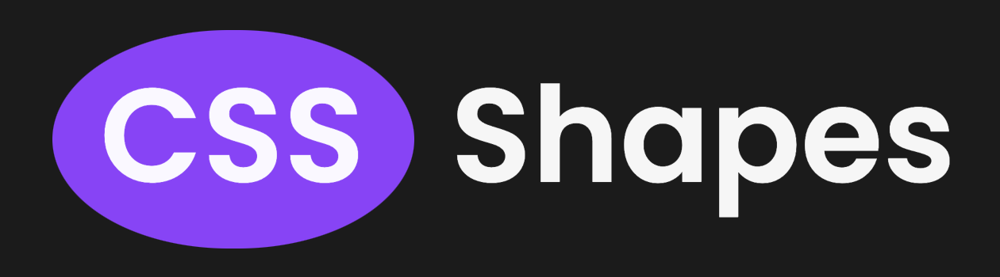

  

CSS Shapes is a library of shapes that can be created entirely with an HTML element and CSS. Using `::before` and `::after` pseudo-elements in combination with properties like `border` and `box-shadow`, a variety of shapes can be rendered on the page.

Each shape has code snippets to copy and paste the required HTML, CSS and Sass/SCSS to render the shape. The download page allows selecting multiple shapes and downloading a stylesheet containing all the rules you need.
